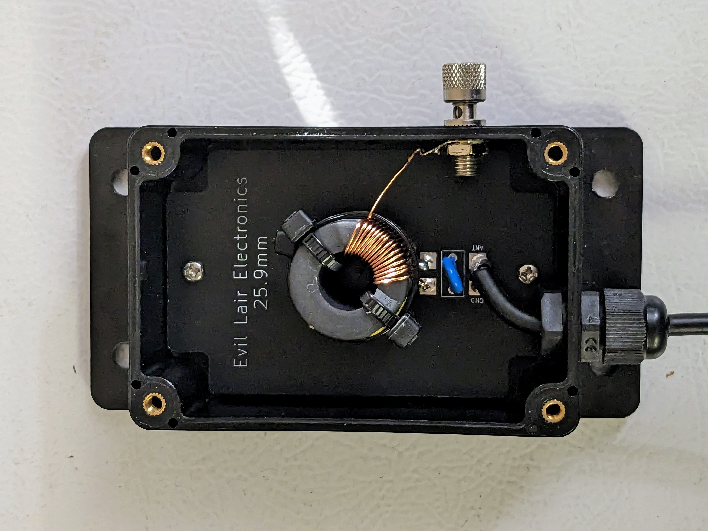
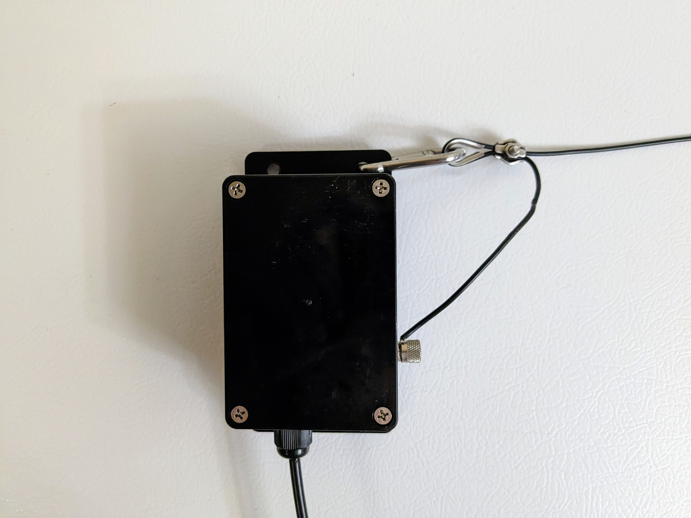

# EFHW antenna related files/info

==================

In the transformer directory are some gerber files for my cicuit boards:

25_9.zip is for 29.5mm ferrite

39_1.zip is for 39.1mm ferrite

50_8.zip is for 50.8mm ferrite 

You can upload a zip file to a place like [jlcpcb](https://jlcpcb.com/) and they will manufacture the boards. Currently the cost is $2 for 5 boards.

All 3 fit the same 100 x 68 x 50 mm enclosure which can be bought here:[Amazon](https://www.amazon.com/dp/B07TYNYW1S?psc=1&ref=ppx_yo2ov_dt_b_product_details)

For the portable 40-10 project I used this ferrite [fair-rite](https://fair-rite.com/product/round-cable-emi-suppression-cores-2661102002/)

If you want to also use 80 meters, then you'll need to use either [fair-rite](https://fair-rite.com/product/round-cable-emi-suppression-cores-2643102402/) or [fair-rite](https://fair-rite.com/product/round-cable-emi-suppression-cores-2643102002/)

If you want something larger you could use 39.1mm [fair-rite](https://fair-rite.com/product/round-cable-emi-suppression-cores-2643251002/) or 50.8mm [fair-rite](https://fair-rite.com/product/round-cable-emi-suppression-cores-2643626102/)

Binding post [cinch](https://www.belfuse.com/product/part-details?partn=111-2223-001)

Ground lug terminals from this ebay seller [ebay](https://www.ebay.com/str/riven99?_trksid=p2047675.m3561.l2563) 6mm fits the binding post. You may want to get some of the smaller sizes also if you do things like mounting RF connectors in transformer boxes.

120pf TDK capacitor was used for the 40-10m project. Any cap with 7.5mm lead spacing should fit the circuit board properly. [mouser](https://www.mouser.com/ProductDetail/810-CC45SL3FD121JYNA)

Cable gland [amazon](https://www.amazon.com/gp/product/B07233GJ6M/ref=ppx_yo_dt_b_asin_title_o05_s00?ie=UTF8&th=1) size PG7 which is suitable for 3mm to 6.5mm diameter coax.

Carabiners [amazon](https://www.amazon.com/gp/product/B0833WSCCF/ref=ppx_yo_dt_b_search_asin_title?ie=UTF8&psc=1)

M2 cable thimble used with AWG18 antenna wire [amazon](https://www.amazon.com/gp/product/B0746D6192/ref=ppx_yo_dt_b_search_asin_title?ie=UTF8&psc=1) if you want to go to a larger wire like AWG14, step this up to M3

M2 cable clamp used with AWG18 antenna wire [amazon](https://www.amazon.com/gp/product/B07FVMKBHD/ref=ppx_yo_dt_b_search_asin_title?ie=UTF8&psc=1) if you want to go to a larger wire like AWG14, step this up to M3